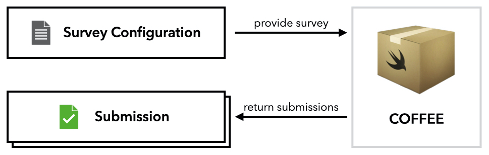
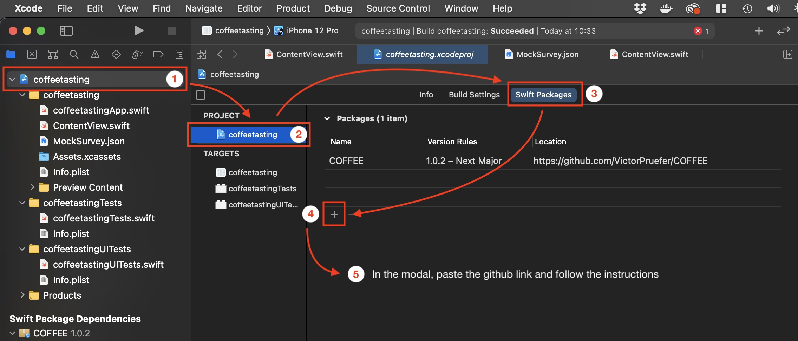
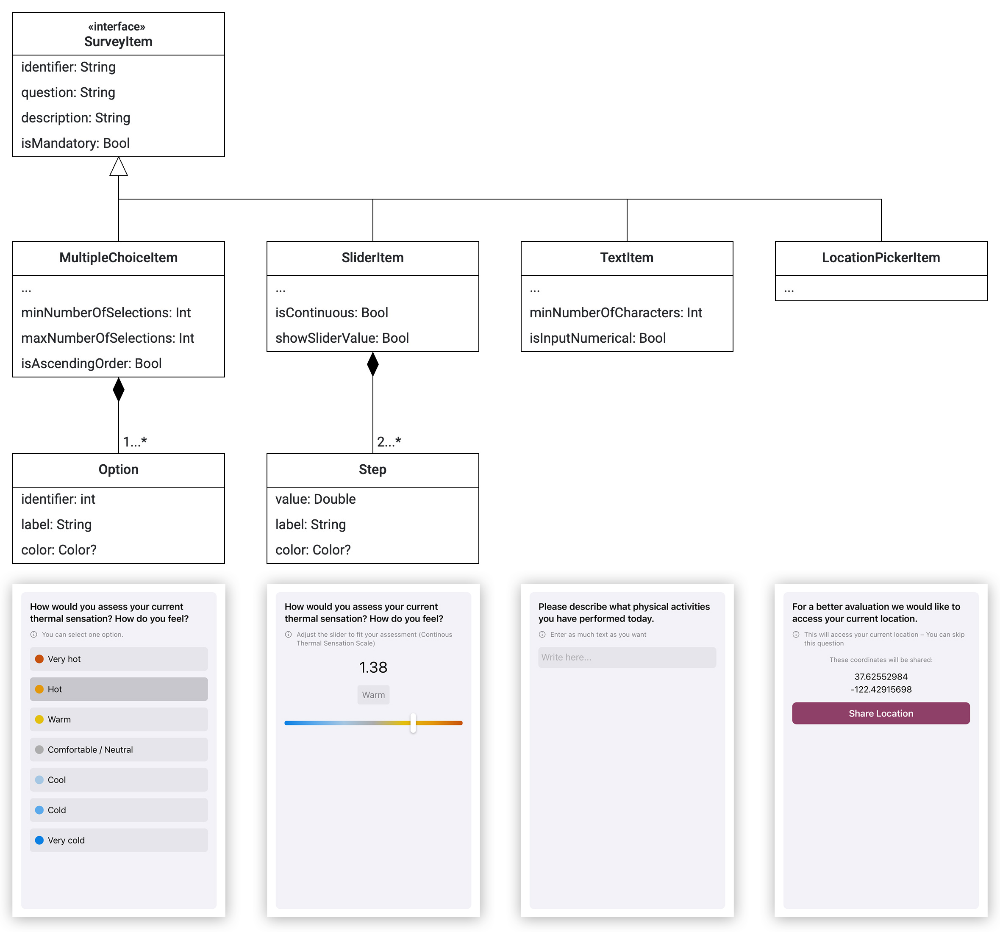

# COFFEE
COFFEE is a lightweight, flexible, and extensible SwiftUI framework to build customizable feedback applications, particularly for thermal comfort and IEQ research.

To setup COFFEE, you need to provide a *survey configuration* that defines your survey questions and other characteristics. COFFEE will visualize the survey and collect the responses. Once a respondent completes the survey, COFFEE returns a *submission* that contains all responses. You can then process the submission e.g. by sending it to a backend.
<center>

</center>

## Setup Guide

### Add Swift Package to Xcode Project
1. Prerequisite: You need an iOS application project in Xcode that uses Swift and SwiftUI
2. Add the COFFEE swift package to your project by copying the link below and following the steps in the image
```
https://github.com/TREATI/COFFEE
```
<center>

</center>

### Embed `SurveyView` in Your Content View
In order to display your custom survey using COFFEE, you need to embed `SurveyView` in your content view and provide an instance of `SurveyView.ViewModel`. The view model requires three arguments:
- An instance of `Survey`: The survey that you want to display
- A completion handler (`((Submission) -> ())`) that takes a `Submission` as parameter. COFFEE calls this function once the respondent completes the survey. The submission contains all responses and other meta data such as the submission date and time
- A `Binding<Bool>` that defines whether the survey view is currently shown

**Recommendation:** You can copy the following code snippet into your `ContentView` as a starting point. It already provides the completion handler and outlines the creation of a survey.

```swift
import SwiftUI
import COFFEE

struct ContentView: View {

   @State var showSurvey = false
   
   // Specify the survey that you want to present
   let survey: Survey = {
       // For each question, pick a suitable item type (see next section)
       let question1 = ...Item(...)
       let question2 = ...Item(...)
       
       // Create survey and add all question items
       var survey = Survey(items: [question1, question2, ...])
       
       // Optional additional survey attributes
       survey.color = ... // Specify the brand color, e.g. for the buttons

       return survey
    }()
   
    // Handle submission after the respondent completes survey
    func didCompleteSurvey(submission: Submission) {
       // Process submission
       print(submission)
    }
    
    var body: some View {
        NavigationView {
            NavigationLink("Start Survey", destination: SurveyView(viewModel: SurveyView.ViewModel(survey: survey, completionHandler: didCompleteSurvey(submission:), showSurvey: $showSurvey)), isActive: $showSurvey)
        }
    }
}
```

## Survey Items

For each question that you want to add to your survey, you need to instantiate a survey item. COFFEE comes with a variety of different item types, so you can choose the one that fits best to your question type. An item type describes the response type and the UI component of a question. 

The following taxonomy shows the currently available item types. 


All item types conform to the `SurveyItem` protocol and thus have to provide a set of attributes:

Attribute | Description | Default Value
--- | --- | ---
`identifier` | Each survey item requires a unique identifier. This identifier can be used to link the responses to the questions | `UUID().uuidString`
`question` | The actual question that the respondent is supposed to answer | *None*
`description` | A more detailed description with additional information / instructions on how to answer the question | *None*
`isMandatory` | Specifies whether the question can be skipped | `true`

<center>

</center>

### MultipleChoiceItem

This item can be used to let the respondent pick from a set of options. The options can have a multiline label and you can assign them colors and values. You can specify how many items have to be selected at least / at max. This way, you can also create a single choice question. As shown in *example 2*, you can add `isSingleChoice` in the initializer as shortpath.

Attribute | Description | Default Value
--- | --- | ---
`options` | Array of `MultipleChoiceItem.Option` that defines the available options | *None*
`minNumberOfSelections` | Defines how many of the provided options have to be selected at least | `1`
`maxNumberOfSelections` | Defines how many of the provided options can be selected at max | `Int.max`
`isAscendingOrder` | The options are sorted by their identifiers. Specify the order | `true`

*Example 1*: A multiple choice question with four colored options
```swift
    var multipleChoiceQuestion = MultipleChoiceItem(question: "What fruits do you like?", description: "Pick all fruits that you like", options: [MultipleChoiceItem.Option(identifier: 0, label: "Apple", color: .red), MultipleChoiceItem.Option(identifier: 1, label: "Orange", color: .orange), MultipleChoiceItem.Option(identifier: 2, label: "Banana", color: .yellow), MultipleChoiceItem.Option(identifier: 3, label: "Watermelon", color: .green)])

    // Additional attributes (optional)
    multipleChoiceQuestion.isMandatory = ... // Can the question be skipped?
    multipleChoiceQuestion.minNumberOfSelections = ... // How many fruits should be selected as least?
    multipleChoiceQuestion.maxNumberOfSelections = ... // How many fruits can be selected at max?
    multipleChoiceQuestion.isAscendingOrder = ... // Should the options be sorted ascending or descending (by id)?
```

*Example 2*: A single choice question with three uncolored options
```swift
    var singleChoiceQuestion = MultipleChoiceItem(question: "Pick the fruit that you like best", description: "Only pick one fruit", options: [MultipleChoiceItem.Option(identifier: 0, label: "Apple"), MultipleChoiceItem.Option(identifier: 1, label: "Orange"), MultipleChoiceItem.Option(identifier: 2, label: "Banana")], isSingleChoice: true)
```

### SliderItem

This item displays a slider and lets the respondent answer the question by adjusting the slider's position. The slider can either be discrete or continuous. The slider's range is defined by `Step`s. Each step can have a color. If all steps provide a color, the slider visualizes a gradient consisting of those colors. As shown in *example 2*, there is a convenience initializer to create discrete, uncolored sliders with numeric step labels and hidden values, e.g. for questions that the respondent should answer on a scale from 1 to 10. You only have to specify a `stepRange` and the initializer will create steps for all values within this range.
 
Attribute | Description | Default Value
--- | --- | ---
`steps` | Array at least two `SliderItem.Step`s that define the slider's range and possible positions | *None*
`isContinuous` | Defines whether the slider is continuous or discrete, i.e. whether positions between two steps are considered as valid input | `true`
`showSliderValue` | Defines whether both the step values and labels are shown or only the labels | `true`

*Example 1*: A continuous, colored slider with three steps
```swift
    var continuousSliderQuestion = SliderItem(question: "Move the slider to a position that reflects your current mood!", description: "Please move the slider", steps: [SliderItem.Step(value: -1, label: "Bad mood", color: .red), SliderItem.Step(value: 0, label: "Okayish mood", color: .yellow), SliderItem.Step(value: 1, label: "Good mood", color: .green)])
    
    // Additional attributes (optional)
    continuousSliderQuestion.isContinuous = ... // Should the slider be continuous or discrete?
    continuousSliderQuestion.showSliderValue = ... // Should the the step value be shown besides the step label?
```

*Example 2*: A discrete slider with eleven steps from 0 to 10
```swift
    var discreteSliderQuestion = SliderItem(question: "From 0 to 10, how would you assess your tolerance unsatisfactory indoor temperatures?", description: "Please move the slider to a position that reflects your assessment best", stepRange: 0...10)
```

### TextItem

Use the `TextItem` for questions that the respondent should answer in written form. You can specify how many characters the respondent should enter at least. 

Attribute | Description | Default Value
--- | --- | ---
`minNumberOfCharacters` | Defines how many characters the respondent has to enter at least before the input is considered valid | 5
`isInputNumerical` | Controls the keyboard type. When set to `true`, a number pad is shown instead of the default keyboard | `false`

*Example*
```swift
    var textQuestion = TextItem(question: "Please describe what physical activities you have performed today.", description: "Enter as much text as you want")

    // Additional attributes (optional)
    textQuestion.minNumberOfCharacters = ... // Specify how many characters have to be entered at least
    textQuestion.isInputNumerical = // Whether a number pad should be shown as keyboard
```

### LocationPickerItem

The `LocationPickerItem` can be used to access the respondent's current geolocation.

*Example*
```swift
    var locationPickerQuestion = LocationPickerItem(question: "Can we access your current location for better evaluation?", description: "You can share your current coordinates.")
    // It is recommended to make privacy-invasive questions optional
    locationPickerQuestion.isMandatory = false
```

## JSON En- and Decoding

You can either specify your survey by instanciating it in the code or by decoding it from a JSON file. Also, you can encode the resulting submission to JSON in order to e.g. upload it to a server. All model entities conform to the `Codable` protocol.

### Decode Survey from JSON

Prepare a JSON file that contains the survey that you wish to present. Example `MockSurvey.json`:
```json
{
    "title": "...",
    "description": "...",
    "researcher": {
        "name": "...",
        "mail": "...",
    },
    "allowsMultipleSubmissions": true,
    "startDate": "2021-04-08T15:00:00Z",
    "endDate": "2021-04-25T20:00:00Z",
    "color": "...",
    "items": [
        {
            "type": "ordinalScale",
            "identifier": "...",
            "question": "...",
            "description": "...",
            "isOptional": false,
            "scaleTitle": "...",
            "isScaleContinous": false,
            "ordinalScaleSteps": [
                {
                    "value": 3,
                    "label": "Very hot",
                    "color": "c7520e"
                }
            ]
        }
    ],
    "reminders": []
}

```

Decode the JSON survey.
```swift
func decodeJSONSurvey() -> Survey? {
    guard let url = Bundle.main.url(forResource: "MockSurvey", withExtension: "json"),
          let data = try? Data(contentsOf: url) else {
        return nil
    }
    let decoder = JSONDecoder()
    decoder.dateDecodingStrategy = .iso8601;
    do {
        let decodedSurvey = try decoder.decode(Survey.self, from: data)
        return decodedSurvey
    } catch let error {
        print(error)
    }
    return nil
}
```

### Encode Submission to JSON

```swift
let jsonEncoder = JSONEncoder()
jsonEncoder.dateEncodingStrategy = .iso8601
jsonEncoder.outputFormatting = .prettyPrinted
let jsonResultData = try? jsonEncoder.encode(submission)
// Resulting json encoded submission
if let jsonResultData = jsonResultData {
    print(String(data: jsonResultData, encoding: .utf8) ?? "Invalid encodation")
}
```
