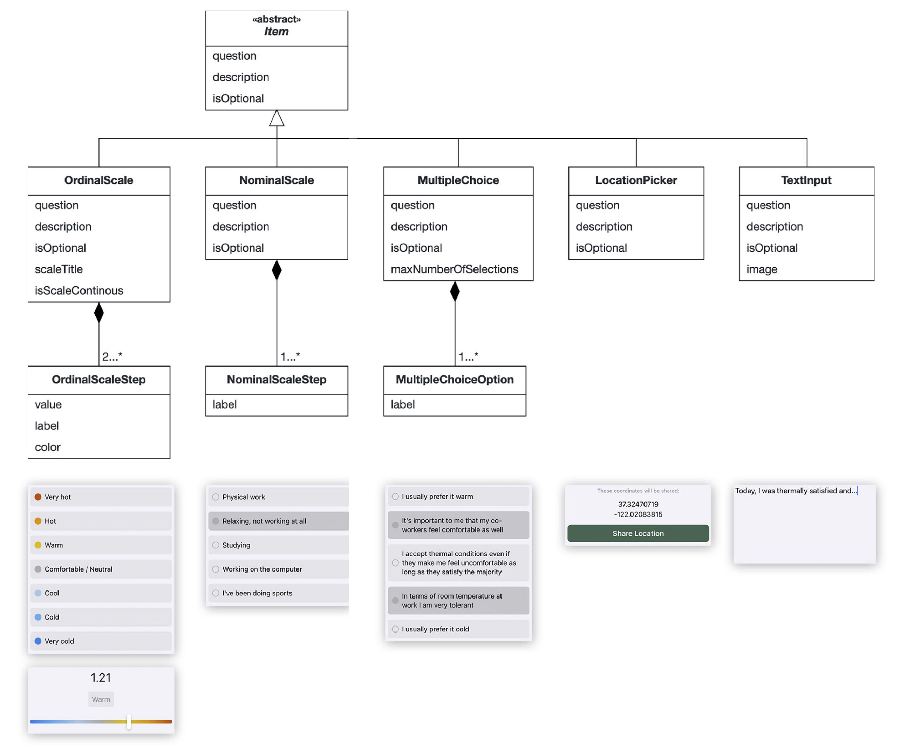

# COFFEE
COFFEE - Customizable Occupant-Friendly FEEdback applications. COFFEE is a lightweight, flexible and extensible SwiftUI framework to build customizable feedback applications for thermal comfort and IEQ research.

## How to use

### Add Swift Package to Xcode Project
1. Create a new iOS application project in Xcode, set language to Swift and interface to SwiftUI.
2. Add the COFFEE swift package to your project by copying the link below and following the steps in the image
```
https://github.com/TREATI/COFFEE
```
<center>

</center>

### Setup Survey and Display it
In order to use COFFEE and to display your custom survey, you need to embed `SurveyOverviewScreen` in your SwiftUI view, which takes two arguments:
- An instance of `Survey`: The survey that you want to display
- A completion handler that takes a `Submission` as parameter. COFFEE calls this function once the respondent completes the survey. The submission contains all responses and other meta data such as the submission date and time.

You can copy the following code snippet into your `ContentView` as a starting point. It already provides the completion handler and outlines the creation of a survey.

```swift
import SwiftUI
import COFFEE

struct ContentView: View {
   
   // Specify the survey that you want to present
   let survey: Survey = {
       // TODO: Specify survey items / questions. For each question, pick an item type that fits best (see section 'Item Types')
       let question1 = ...SurveyItem(...)
       let question2 = ...SurveyItem(...)
       
       // Create survey and add all question items
       let survey = Survey(title: "Survey Title", description: "Survey Description", allowsMultipleSubmissions: true, startDate: Date(), endDate: Calendar.current.date(byAdding: .day, value: 1, to: Date())!, items: [question1, question2], color: "42a7f5")
       
       return survey
    }()
   
    // Handle submission after the respondent completes survey
    func didCompleteSurvey(submission: Submission) {
       // Process submission
       print(submission)
    }
    
    var body: some View {
        NavigationView {
            SurveyOverviewScreen(survey: survey, completionHandler: didCompleteSurvey(submission:))
        }
    }
}
```

## Item Types

For each question that you want to add to your survey, you need to instantiate a survey item. COFFEE comes with a variety of different item types, so you can choose the one that fits best to your question type. An item type describes the input type and the UI component of a question. 

*Example:* If you wish to let the respondent answer a question by entering text, you should use the `TextInputSurveyItem`. If the respondent should respond on a numeric scale, the `OrdinalScaleSurveyItem` is the right choice.

The following taxonomy shows the currently available item types..

<center>

</center>

<table>
  <tr>
    <th>Item Type</th><th>JSON Type Identifier</th><th>Description</th>
  </tr>
  <tr>
    <td>OrdinalScaleSurveyItem</td><td>ordinalScale</td><td>Use this item if you want to display a numeric scale. Both discrete and continous scales are supported. You can specify the scale steps and associate each of them with a value and color.</td>
  </tr>
  <tr>
    <td>NominalScaleSurveyItem</td><td>nominalScale</td><td>This item can be used whenever you have a set of options and you want to let the respondent pick one. In contrast to the ordinal scale, the steps do not have a numeric value or color associated.</td>
  </tr>
  <tr>
    <td>MultipleChoiceSurveyItem</td><td>multipleChoice</td><td>This item can be used to let the respondent pick multiple items from a set of options.</td>
  </tr>
  <tr>
    <td>LocationPickerSurveyItem</td><td>locationPicker</td><td>This item requests the respondent's location. Note that if you wish to use this item, you need to add the `Privacy - Location When In Use Usage Description` key to your project's `Info.plist` file.</td>
  </tr>
  <tr>
    <td>TextInputSurveyItem</td><td>textInput</td><td>This item lets the respondent enter any text to respond to the question.</td>
  </tr>
</table>

## JSON En- and Decoding

You can either specify your survey by instanciating it in the code or by decoding it from a JSON file. Also, you can encode the resulting submission to JSON in order to e.g. upload it to a server. All model entities conform to the `Codable` protocol.

### Decode Survey from JSON

Prepare a JSON file that contains the survey that you wish to present. Example `MockSurvey.json`:
```json
{
    "title": "...",
    "description": "...",
    "researcher": {
        "name": "...",
        "mail": "...",
    },
    "allowsMultipleSubmissions": true,
    "startDate": "2021-04-08T15:00:00Z",
    "endDate": "2021-04-25T20:00:00Z",
    "color": "...",
    "items": [
        {
            "type": "ordinalScale",
            "identifier": "...",
            "question": "...",
            "description": "...",
            "isOptional": false,
            "scaleTitle": "...",
            "isScaleContinous": false,
            "ordinalScaleSteps": [
                {
                    "value": 3,
                    "label": "Very hot",
                    "color": "c7520e"
                },
                ...
            ]
        }
    ],
    "reminders": []
}

```

Decode the JSON survey.
```swift
func decodeJSONSurvey() -> Survey? {
    guard let url = Bundle.main.url(forResource: "MockSurvey", withExtension: "json"),
          let data = try? Data(contentsOf: url) else {
        return nil
    }
    let decoder = JSONDecoder()
    decoder.dateDecodingStrategy = .iso8601;
    do {
        let decodedSurvey = try decoder.decode(Survey.self, from: data)
        return decodedSurvey
    } catch let error {
        print(error)
    }
    return nil
}
```

### Encode Submission to JSON

```swift
let jsonEncoder = JSONEncoder()
jsonEncoder.dateEncodingStrategy = .iso8601
jsonEncoder.outputFormatting = .prettyPrinted
let jsonResultData = try? jsonEncoder.encode(submission)
// Resulting json encoded submission
if let jsonResultData = jsonResultData {
    print(String(data: jsonResultData, encoding: .utf8) ?? "Invalid encodation")
}
```
